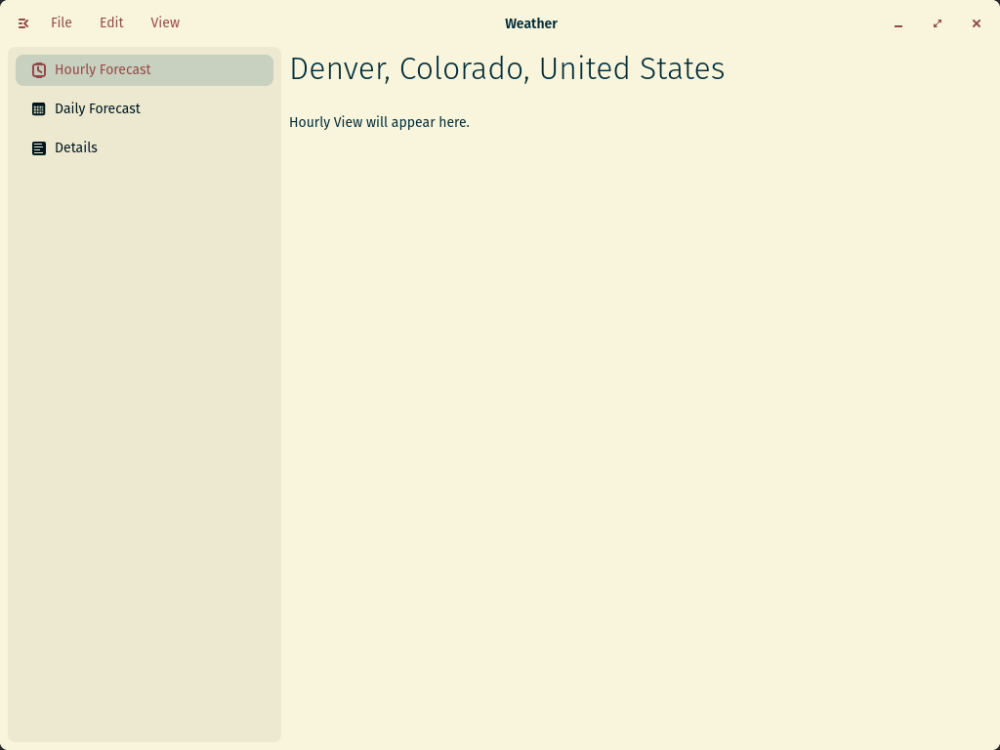

<div align="center">
  
  <h1>Forecast</h1>
  <p>A simple weather application for the COSMIC™ Desktop</p>
  </img>
</div>

# Installation

[](https://flathub.org/apps/com.jwestall.Forecast)

## Manually

```
git clone https://github.com/cosmic-utils/forecast.git
cd forecast
sudo just install
```

# Build
```
git clone https://github.com/cosmic-utils/forecast.git
cd forecast
cargo build
```

## Dependencies
- [libcosmic](https://github.com/pop-os/libcosmic?tab=readme-ov-file#building)

# Copyright and licensing

Copyright 2024 © Jacob Westall

Forecast is released under the terms of the [GPL-3.0](https://github.com/cosmic-utils/forecast/blob/main/LICENSE)
